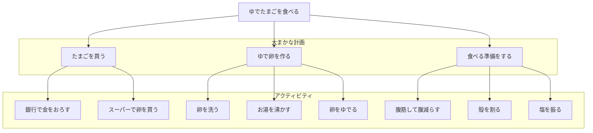

```mermaid
flowchart TD
    id1["ゆでたまごを食べる"]
subgraph "大まかな計画"
    id2["たまごを買う"]
    id3["ゆで卵を作る"]
    id4["食べる準備をする"]
end
    id1-->id2
    id1-->id3
    id1-->id4
subgraph "アクティビティ"
    id5["銀行で金をおろす"]

    id6["スーパーで卵を買う"]

    id7["卵を洗う"]

    id8["お湯を沸かす"]

    id9["卵をゆでる"]

    id10["腹筋して腹減らす"]

    id11["殻を割る"]

    id12["塩を振る"]
end

id2-->id5
id2-->id6
id3-->id7
id3-->id8
id3-->id9
id4-->id10
id4-->id11
id4-->id12

```