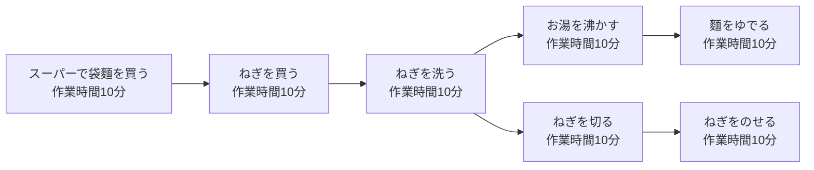

```mermaid
flowchart LR
id1["ねぎを買う
作業時間10分"]
id2["スーパーで袋麵を買う
作業時間10分"]
id3["お湯を沸かす
作業時間10分"]
id4["麵をゆでる
作業時間10分"]
id5["ねぎを洗う
作業時間10分"]
id6["ねぎを切る
作業時間10分"]
id7["ねぎをのせる
作業時間10分"]

    id2-->id1
    id1-->id5
    id3-->id4
    id5-->id3
    id5-->id6
    id6-->id7
```