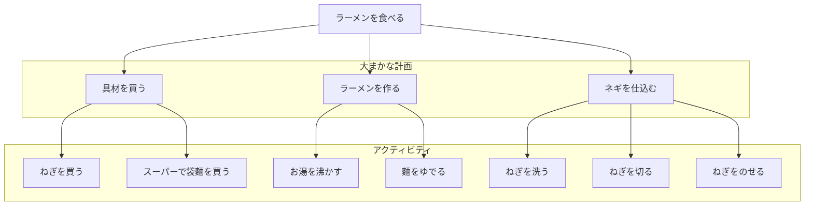

```mermaid
flowchart TD
    id1["ラーメンを食べる"]
subgraph "大まかな計画"
    id2["具材を買う"]
    id3["ラーメンを作る"]
    id4["ネギを仕込む"]
end
    id1-->id2
    id1-->id3
    id1-->id4
subgraph "アクティビティ"
    id5["ねぎを買う"]

    id6["スーパーで袋麵を買う"]


    id8["お湯を沸かす"]

    id9["麵をゆでる"]

    id10["ねぎを洗う"]

    id11["ねぎを切る"]

    id12["ねぎをのせる"]
end

id2-->id5
id2-->id6
id3-->id8
id3-->id9
id4-->id10
id4-->id11
id4-->id12

```